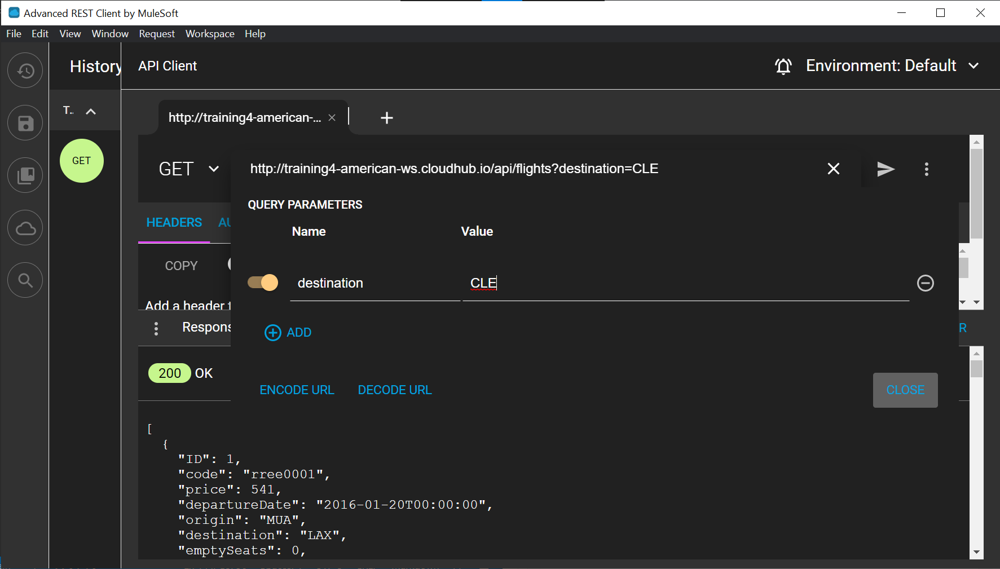
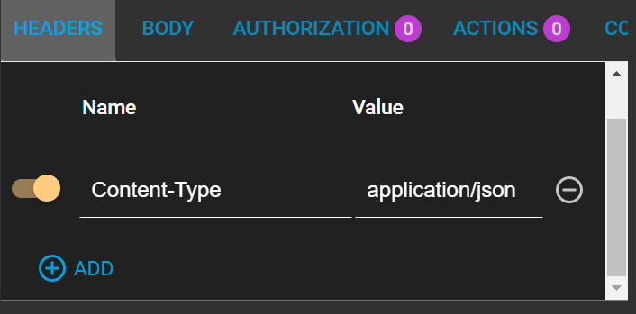

# MuleSoft - Connecting data to applications 

<a src="https://blogs.mulesoft.com/learn-apis/api-led-connectivity/what-is-api-led-connectivity/">API - Led connectivity</a> is a methodical way to connect data to applications through reusable and purposeful <a src="https://developer.mozilla.org/es/docs/Learn/JavaScript/Client-side_web_APIs/Introduction"> API </a> (available prebuild connection points for several programming languages) that allows developers create complex functionalities for an easy consumption when developing an application, not worring about what's going on under the hood, just the necessary means of connections like an electrical outlet on a wall.
<figure>
     
    <figcaption>Electrical outlet; source: MDN Web Docs. </figcaption>
</figure>

This notes embrace:
* What an application network is and its benefits.
* How to build an application network using API-led connectivity.
* An Explanation of what web services and APIs are.
* Making calls to secure and unsecured APIs.

----

**The usefulness of this for businesses**

The constant rate of change on IT require to levarage new ways to create assets to be consumed by business fast enough.


### Purpose of reausable assets
It is import for organizations the cycle of **production** as well as **consumption** of data for IT, either for own development of services or better fit the needs of consumers.

The main idea is that **data sources** are now needed to be accesible, flexible to grow, secure enough to continue  developing different applications regardless the numerous development of projects or the amount of time passed.


## API-Led connectivity mindset is:

* **Assets** have to be <a src="https://en.wikipedia.org/wiki/Composability" alt="Composability"> composable </a>; a highly composable system provides components that can be selected and assembled in various combinations to satisfy specific user requirements, in order to make reusable data.

<figure>
    
    <figcaption>API-Led connectivity example</figcaption>
</figure>

## Center for enablement (C4E)
Ensures that assets are:
* Productized and published.
* Consumable.
* Consumable abroadly.
* Fully leveraged.

Is a cross functional team ensuring all new projects uses current assets and producing new ones when needed.  

<a id="app_network"></a>
## Achieveing an Application network
Within an organizations there are many different systems been used, legacy databases, social apps and many more, that are side loaded.

<figure>
    
    <figcaption>node of network</figcaption>
</figure>

## What is an API?
Stands for Application Programming Interface, they have existed since the advent of programming languages, from 50s to 60s and provide us the info for *how ro communicate with a software component*  but it could be referring to a number of things:
* API interface definition file (API specification).
    * Defines what you can call, what you send it, and what you get back.
* A web service.
    * Te actual API documentation you can make calls or to the interface of that API implementation.
* An API proxy
    * An application that controls access to a web service, restricting access and usage through the use of an API gateway.

## What is a web service?
Is a method of communication that allows two software systems to exchange data over the internet, with some rules required.
* **A web service API**: comprehensive description of how a client interacts with the web service.
* **The web serice interface implementing the API**: Is the code providing the structure to the application so it implements the API.
* **The web service implementation itself**: is the actual code and application.

### There are 2 main types of web services
* SOAP web services:
    * traditional, more complez type,
    * The communication rules are defined in an XML-based WSDL (Web services Description Languafe) file

* RESTful web services
    * Recent, simpler type.
    * Use the existing HTTP communication protocol.

### RESTful web services
Stands for Representational State Transfer.
It defines how systems comunicate using HTTTP protocol.

**HTTP** request method indicates which operation should be performed on the object identifies by the URL.
Examples of RESTful calls:
* (GET)/companies
* (GET)/companies?country=France
* (GET)/companies/3
* (POST)/companies with JSON/XML in HTTP body
* (DELETE)/companies/3
* (PUT)/companies/3 with JSON/XML in HTTP body

**GET** retrieves the current state of a resource in some representation (usually JSON or XML)

**POST** creates a new resource

**PUT** replaces a resource completely, if the resource doesn't exist, a new one is created

**PATCH** partially updates a resource, just submitted data

---

## Calling RESTful web services
Sources:
* American Flights web service
http://training4-american-ws.cloudhub.io/api/flights
* REST API Vimeo http://www.programmableweb.com/api/vimeo-rest-api 

Making a call to a RESTful API is posible using a client tool, such as <a src="https://www.postman.com/" alt="postaman oficial page">Postman </a>, <a src="https://www.postman.com/">Advnaced REST Client</a>, or <a src="https://curl.se/docs/manpage.html">cURL</a> a command line utility.

You can make calls to secure and unsecure APIs, here's the catch:
* **Unsecured APIs**, the API may be public and require no authentication.
* **Secured APIs**, the APImay be secured and require authentication
    * You may need to provide credentials and/or a token
    * Often a proxy is created to govern access to an API
    * We will call and then later create an API secured by credentials
    * You can also secure an API with other authentication protocols, such as OAuth, SAML, JWT and more.

This training will make calls to and create a secured API.

### Getting response from web service calls
* RESTful web services return HTTP status code with the response
* <a src="https://developer.mozilla.org/es/docs/Web/HTTP/Status" alt="HTTP status codes">The status code</a> provides client feedback for the outcome of the operation (succeded, failed, upadates), there are 55 HTTP codes.

* Using Advanced REST Client, will be making several calls to an unsecured API (an implementation), no need of token or authentication.
* Make GET, DELETE, POST and PUT calls
* Use ARC to make calls to a secured API (an API proxy), authentication is needed
* Using API console in an API portal to make calls to a managed API using a mocking service.
* Using the API console to make calls to an API proxy endpoint.

## Using Advanced REST Client to make GET requests to retrieve data
1. Open Advanced REST Client
2. Make sure the method is set to GET
3. Return to the course ``snippets.txt`` file.
4. Copy the URL for the American Flights web service: http://training4-american-ws.cloudhub.io/api/flights 
5. Return to Advanced REST client and paste the URL in the box that says Request URL, replacing any existing content.

6. Click the send button, you should get a response.
7. Locate the return HTTP status code of 200.
8. Review the response body containing flights to SFO, LAX, and CLE.
 
9. Select Raw from the options menu in the response area

10. Click the Open parameters editor icon (the pencil) to the right of the URL
11. In the query parameters editor area that appears, click the Add button.
12. Set the parameters name to the destination and the parameter value to CLE then click Close.

13. Click the Send request button, you should get just the flights to CLE returned.
14. Edit the query parameters again, click te Remove this parameter button next to the parameter to delete it then click Close.
15. Change the request URL to add a URI parameter to retrieve the flight with an ID of 3: http://training4-american-ws.cloudhub.io/api/flights/3 
16. Click the send button, you should see only the lfight with an ID returned.


**Make DELETE requests to delete data**
17. Change the method to DELETE.
18. Click the Send button, you should see a 200 response with the message Flight deleted
<figure>
    
    <figcaption>DELETE HTTP method</figcaption>
</figure>

19. Remove the URI parameter from the request http://training4-american-ws.cloudhub.io/api/flights 
20. Click the send button; you should get a 405 response with the message Method not allowed
<figure>
    
    <figcaption>DELETE HTTP method not allowed</figcaption>
</figure>

**Make a POST request to add data**

21. Change the method to POST. 
22. Click the send button, you should get a 415 response with the message Unsupported media type
<figure>
    
    <figcaption>POST HTTP method unsupported media type</figcaption>
</figure>

23. Click the Add button in the header area.
24. Select Content-type in the resultant Header name drop-down menu.
25. Type app in the Header value field then select application/json.


26. Select body tab.
27. Return to the course ``snippets.txt`` file and cop the vlue for American Flights API post body. 
```
{
  "code": "GQ574",
  "price": 399,
  "departureDate": "2016/12/20",
  "origin": "ORD",
  "destination": "SFO",
  "emptySeats": 200,
  "plane": {"type": "Boeing 747", "totalSeats": 400}
}
```

28. Return to Advanced REST Client and paste the code in the body text area.
<figure>
    
    <figcaption>POST body raw input</figcaption>
</figure>

29. Click the Send button, you should see a 2021 Created response with the message Flight added (but not really).
<figure>
    
    <figcaption>POST response, http response 201 - Created</figcaption>
</figure>

30. Return to the request body and remove the plane field and value from the request body.
31. Remove the comma after the emptySeats key/value pair 


32. Send the request, the message should still post succesfully.
33. In the request body, remove the  emptySeats key/value pair.
34. Delete the comma after the destination key/value pair

<figure>
    
    <figcaption>POST bad Request</figcaption>
</figure>
35. Send the request, you should see a 400 Bad Request response with the messageBad request.
<figure>
    
    <figcaption>POST bad Request</figcaption>
</figure>

**Make a PUT request to update data**

36. Change the method to PUT. 
37. Add a flight ID of 3 to the URL.
38. Click the send button; you shouldget a 400 Bad Request.
<figure>
    
    <figcaption>POST bad Request</figcaption>
</figure>

39. In the request body field, press Cmd+Z or Ctrl+Z until the emptySeats field is added back.
40. Send the request; you should get a 200 OK response with the message Flightupdated (but not really).
<figure>
    
    <figcaption>PUT succesful http method</figcaption>
</figure>

**Make a request to a secured API**

41. Remove the Content-Type header by selecting the Headerstab then clicking the Remove this parameter buttonnext to the header.
42. Change the method to GET. 
43. Change the request URL to http://training4-american-api.cloudhub.io/flights/3 .

*Note: The -ws in the URL has been changed to -apiand the /api removed.*

44. Click the send button; you shouldget a 401 Unauthorized response with themessage Invalidclientidor secret.

<figure>
    
    <figcaption>401 unathorized response</figcaption>
</figure>

45. Return to the course ``snippets.txt`` file and copy the value for the American Flights API client_id.
```
* American Flights API client_id for APDev fictitious application
d1374b15c6864c3682ddbed2a247a826
```
46. Return to Advanced REST Client and add a header called client_id.

47. Set client_id to the value you copied fromthe snippets.txtfile.
48. Return to the course ``snippets.txt`` file and copy the value for the American Flights API client_secret.
49. Return to Advanced REST Clientand add a second headercalled client_secret.
```
* American Flights API client_secret for APDev fictitious application
4a87fe7e2e43488c927372AEF981F066
```
50. Set client_secret to the value you copied fromthe snippets.txtfile.

<figure>
    
    <figcaption>Custom headers on Advanced REST Client </figcaption>
</figure>

*Note: The client credentials in the snippets file may be different than what is shown here; the values in the snippets file differ for instructor-led and self-study training classes.*

51. Click the send button; you should get data for flight 3 again.

<figure>
    
    <figcaption>Response to Custom headers on Advanced REST Client </figcaption>
</figure>

52. Click the send button several more times; you shouldget a 429 Too Many Requests response with the message Quota has beenexceeded.

*Note: For the self-study training class, the API service level agreement (SLA) for the application with your client ID and secret has been set to allow three API calls per minute while, for the instructor-led class, the SLA allows for a higher number to accommodate shared use.*

<figure>
    
    <figcaption>Too many responses</figcaption>
</figure>

### Using the API console in the API portal to make requests to the API using a mocking service

53. Return to the browser window with the American Flights API portal at https://anypoint.mulesoft.com/exchange/portals/muletraining.
54. In the left-side navigation click the GET method for /flights.
55. Review the Headers and Responses sections.
56. In the Responses section, look at the output example.
57. In the API console located on the right side of the page, make sure the Mocking Service endpoint is selected.

58. Look at the endpoint URL that isdisplayed.59.Selectthe Show optional parameters checkbox.
60. Select LAX in the destination drop-down menu.
61. Enterany valuesforclient_idand client_secret.
62. Click Send; you should getthe example flights that areto SFO and ORD.

<figure>
    
    
    <figcaption>API console for retrieving data</figcaption>
</figure>

**Makerequests to the API using an API proxy endpoint**

63. At the top of the API console, change the endpoint to Production –Rate limiting SLA based policy.
64. Look at the endpoint URL that is displayed.
65. Click Send; you should get a 401 Unauthorized response.


66. Copy and paste the client_id and client_secret values from the course ``snippets.txt`` file. 
```
* American Flights API client_id for APDev fictitious application
d1374b15c6864c3682ddbed2a247a826

* American Flights API client_secret for APDev fictitious application
4a87fe7e2e43488c927372AEF981F066
```

67. Click Send; you should get a 200 OK response with only flights to LAX.


## API Development cycle


# Anypoint Platform


Supports the needs of every role:
* Specialits
* Admin,  Ops, DevOps.
* Ad-hoc integrators.
* App devs.

Allows you to develop once and deploy anywhere.


### Anypint Platform Components:
* API Designer
    * are all details about operations' inputs and outputs
* API Console & Mocking Service 
    * Are used to interact and simulate the API, the spec can be publish on Exchange in order for stakeholders to provide feedback.
* API notebook 
----
### Exploring Anypoint Platform

At Anypoint Platform https://anypoint.mulesoft.com/, on the left-side menu access to -> **Access management**
![](data:image/png;base64,iVBORw0KGgoAAAANSUhEUgAAAVEAAACVCAMAAADWpjlmAAABs1BMVEX///8mJygaHR3z9PQDoeHR0dH29veEhYQdHh9paWoNERFkZWXv7+/V1dWBgoIIDg7f4N8AnOB2v+oAAAAWGRlub296e3q12vPW6vgnKCmTlJQSFha00NpERUWLjIxTVFT///owMjKdnp4aGhhbXFz/8fU6PDxJSkq6u7v///X2/P//9drz//8+QEAbAAAApuivr68bDADX3+Whpbv//eaUmp+ik3ORhoKwnHnGs65ItuiAye684/ab0/Hk1cQWNkQGZ40HbpUDlc8MX4AWKjALfq4SQlUNU261tbULeaaEjZaPk66rqaD16dqhn6ukq7Rnd4rv4MN2mrt7cYDFqZr75tTK3fZzg4u7wtPOtJq3yum/p6TUxrWNgI52aGqYs8CysZx4Z1irjnuurMadl5CPfHXR5+qPeX+sm6uKiniDeWZWVm2QsMyriGU4UG48Okeju9XYtqXZw7/Eu8VzlKe8nZfFspJHbo1pcpKkgWbayKprhKCkl4nE0syr3/W5tMSmqNTKy+PRy7FTUEJoUDysjY2OobIwGgBVZnSVnsV/sebj2+2evuWuweiGjaWFv++IYj7KG6UuAAAPJUlEQVR4nO2diUPaWB6AH2oAMRxyhBAsR6SapFjTIOMCkpm2s1OWJVKnlKYYt51Kz+3M2trOzlg7XWa37qyg7J+8L0ELYtrxiEjZ91XMS+Iz5uvvnQkB0I7eYRl8HDQgPM7eEbRarUMDjW0UEM6eHtEUMA00Vl+vjQ5ZB9vpORhVnQ4w52IUFv3B5eNGvR3pyUmjlQ5u0f+oUe9MW+nkl18arnRgnXYY9bbYN3rhg9Erl7+6fvnKvlOv56OS1D0e70d3HyA4qNVp22j0woyGtcvo5FdXr83OXrv6VUup14pBcd7g3svbTg+ZGOeQk4l6g3sbh7SEt6VPTeyvw53BsG2of6vTaCCo999tPbDowhbc27tvNDhGtYh2Gb1yffbq119fnb1xRVt1Er5w0Dkd9touwFd42hmciVmDUzETjDlm2hlmAt7YtG0oGgt4A7GZoG16OuA1xUzewPS0LRaFOS7YTFOxISffqlXOxsgp8VKu3KjmbTpgmpqBqamwFdZSY2ETHKBMj3p18kxhTFRLtGPU6WnhPWh08sq1q5cnJy//8Y+tcu+hAg7PKOGbiRG+6THCEQ47fFMXQj744wEH5QkR0diYJRZgRmnn2FhoKuYgaE9ojPLAsS4/Sg+N+SzTMd5Hefjp1u/vx+o0aHH4QlqCD3loaso6Ne0I+gIWYiwYC1uZGD1zKIuXJihaM92O0VioxcEYnfzy6qzaLE1+M3L1a3XzDOGhnBaPzUlYbR6KIEIzIYd3inKYVKOWCw4i6iUoH7RORAMEFSMCQ44oTdBRh2mI8limaMJCxMIeaPhDddx31al1hvHFCDXlpegABUPCEoOnQo3R0bEQHean6ahOpmm7RTuTdox6gy2GDsbo1zdmv4FGr9wYuaFFMqwX+LDF6bQ5TPAVgJWjzUR7bFbaORSweOxBIkB7Yr4o4VETYzFHwBoKOGD9SgRMFmiUssH6JewJdRjtu4FplAmN7Rsdo33QKIwMJuRwenNEGLoNhGyHM1kdtLOV2DfqnQq3MHXVo5f/dO0K5NpVrR61UR6P1TJDUVNTFHXhgvay+KbgywZj1AlDF0Ym7Qv4PL5AKETHojRFeRxUCK6aHB7HFMw5E5t2Wmwxh62j5e+psd8jSjMWwqGmrCFTLkoQNB/2+WjCBysAmg+EnHTscLkashCtjZ2lvjUb1d0yTV4fuXb9+rWR6622Xv1hp9fp9HqdNm9rCRNOm+qn9bLZnDZ1ATd6glaPyQHXneo+dZuaAzb5ThjaQ530U3UamHbC2k1LWk1B2BgNaTNm8OU1eYOmIZNey2SNhfcSH0p9cG++bajb6I1vvrp27fo3N07SyfdGQ6Gpo/VQ+646PSb7f//Hx0wfeviTk1euX79ywoGoN2g7Ype/76rTE/LxcX20I238uF6Xzz1MNc5p7uljDIDTPjPaZ63+Seg7o599ddqHRvuqJ3V8VKMeW7+h9v8+V4I+QI2dmNjJs/4Oo58vFuACJ8Z88qyDi/00RnGk9DDIqNEgo0aDjBoNMmo0yKjRIKNGY5hRM47jwx37/m9lG2b0izxF/bm9GikcJT938mP3LS2jX8QlalEKFZmkkKJdFB9nb4Klb8EtUPLfJqVdoCQTYl74Q5m9I+blu/5LcvUOCbqMxo9/8BcVo06jj9CMziVWl+NgMw6UovBaYFdwwP5lYfPe7fuVVFIkSzyeALi4KBS2pDvilqDkpYokq5kPGy2EfHKEBqAk5IBCEbJEQPUwkQAsNX/HXiVgvvs+bY0Q2O/GBGmeWBysSNWMpooryyQowXMXYOBMgAfk3Go1V7yfy6cePXz0uMAkIu/f1sATZSsnrgHF9bSsYxSW+jJ4VgbfkQ9J9q+RefCH58A1ykmj4Ps18GBi7gdO+hsZ+Qu58RyU1uZ+iEs31Rj9fgG4BtAoAySMTrB0EaMxWOr5YpytKSQjg5dMXGHKgBHpRSmJrUsyJiVlkVPKOKZmPmCUNA9z4GkclMobzzees9AoCaQEANX4z3GwsTb3CoA8B16TP96kn36rrcWhUYWgsfM697PBuJZJK/VPOWiUzT8g94zmAaxMfuZaRiM3odHyj/7hYaCuaUbBMP6gfNqT6CuMMypjmKAZ9YPv/w5aRiPfycpPYD9GW0Zv/yZsamt3uI03YF52PSNPfxp9hGFGxVwu9w7YObValAQQsQMR1o+R3DpQN0oCC6toWL5dOJB4GahrcLMisDleOP1Z9BNozGQ0yKjRIKNGg4waDTJqNMio0SCjRtM2GgkVikCb11S/WExL29na3hY9kFEd2kaXKiDF5Jf5vPRFeZ56u6rcwqvyimuCLmDzm37dzMioDh1Gn4PldVJMPuKVVUyERskUtsWwTIJdlG+v6WbuMEq6T87AjkJTtCBxd/kiU6i5JFf9PcPwcsouKDQuSPqTGR1G/eMnZ2CNaihwcH5kDhgdOSkDbvRYIKM6IKNGg4wajeFG01BRemRcXX5QpqU7lR/Qj4y2OWx03J0dH8lkRtyZzPh4Oj2ezozAb+mRtBumZt0wkUlnxmfhVrhxIY2MdqETo9nMbHbkl3TGnYE2M+kFuGEkC7eMZGezGXd29pd0Ng2/slmoNjuOjHZx2Gg6m8lmxqE0GInubHo2O55R/Y1kZuFW9ywMUHXXL264yT3wRucqkWN0RTUOG3WPqAphWGZgiYax6R6HJkcy6hJqhhbds+lZNUjdI+nZzICX+kv/iKymeIkuKouF4tFuStBt68dHxrWvD+3PXiQebpn29w+w0YSULG0xDJBo/EiZUe9Jh47ZvCotKFXXooxxCn20k0RGdUA9fKNBRo3GOKNoNq8Fus5kNMio0SCjRoOMGg0yajRto2xSHXuytWNkRkZ16ByFbtQKSbaWKorJI94ki4zq0GH05q4kLE28CxXsNDJ6cjpjVJGpEC5Xi67CvaNlRkZ1QC2T0SCjRoOMGg0yajR2cIq3EyGjOtjBxMkzI6M6IKNGg4waTdsoy+da15TXdS4t66tDRnVoG72Ux9WL9RyzLiXthSJM43SxOiHRgkILzxKKzjX8LqNsPi6eIuKN534o1Pt3mreNzvnkX4XHYnFxeeM/d8ulX3eWmbUv8CcP+Feb0uom2NQZmXYZnfvnt0trSlWWQvlCnrtPnf+bkt+TJVJhQvOkSOm/k+AM6IjR3xiFfAz+VX69sXM7eWtDNboZeXK3iFWl1R/XlFuHL7B1Gy0+LEyIhTcbz++uldbHNv/eg7//07wnl7Y2sT9fevOM/qFXx+xomXAoqPWPU11x2vuYzDCpfT/wMKf9HF1Gt6R/M7/9+mZj4q6/hPns/RCj4L+vbt8U3zyU7b06ppFtPSuAl4JStEukRIqkdNQ5wTMEM4MH5du3eE59SkKPGPTek7ILpNWeHnHQjfYeZNRo0NyT0Rhl1DyM0DBjKEYNpuOOXKz7cWt2EMG1JzNp6DzaEhnVoeNa6H+G7Wa7RVAEnHHxssTjKTCXkAr/kIrm1Dspbxd3BXCwn4yM6tB5vV6WfBwj5VeWF8RyYTh1DxotFi+tPi7k5BckZhcrd7GD/WRkVIfOGMVFiixIRTwVF0l+076lGuXFVcolCS/IRUxMsLcOlnxkVIfOetTuArgLdwk4GOZwHMNxWI/imFnCcDPOuXCAuYoHM3cbrVT2ZlPM/fG4Rolh9kJA6t2I+Fi9J6yrceoyetHNbXN1PyArZr+54ifL+k836R2iLObBSxkwsiSIOcye64VXI3v4F7Og7m/W3NvkxUzD3GyQO+d8h71YA5viVun+K7Pydmtp9enwbg8OarDRnfK2n8S365nKNrkTr5270citjV2GEx2K8LjIVQHdg4MaatTd9IOdRrnSrGcbjUbl3I1K+ZDA0osuumi353kmB3I9OOhZjeu3y9sn/71nwO0tZas3Rzoro2auz54gjh/tra6nB809GU2H0UgrqoY1T0dyhYzq0GH0xfMIHuFchbdCwQyewN6nEMEE/FNPq0dGdegwGqKltaV7idRbmebAItiQed61+P5TV7wOfPYNokV7flRcU5i1jXtryttKAahGydTLRS5S/UQLg2JUh3aM2kHE9TLHKUWcFAWg8FyKTOV2saPGKGKPT7b1IvPpgTAyqgPqPRkNMmo0ho7rt5v7A/lIc28TVz/Hsb0U+vBpWsrebQk4SJ3xYM7guadmuSE0s6DScNe5GlfJwiVZbi7UM83zGJSKZWWiULTTMks/m1gHTISWf773kiskuRRd/P3sJ8NQo+nmQpNrxGuVrNm9wzXqWVAv1/1NsF1bKJ9HqIr5PPsTSIL5VHljYhHQKRIsx9+La1LisfoZdGeDoUYzADRBg6xUGheh0e16BtT9LaMkeS5Ga4B9FaHASqp8d2IlEtKMvhafS1sroPA5GDVDa2VwseEHlWz5YiMLyllztk7WG2SdO5cPslQ/JwoDEi2wBZ5TeDnCy1IRA6kihwHsczCKUEFGjQYZNRpk1GiQUaNB948aTGt+VKSFFI9Vt95RCQx/BzCWpnHY3ziOUcQ+WoyWZFDFuCU/7PYuu26R6yUSzB3l9gtkVIdWqReLBQFsQKPcsgurvivES2V28/dHOcioDppRpSAv0+RSGeS4lEu+vSXlqxifRKX+RBjb1ne0VH13BwTo0S0Qhs6UNBsfaor6L83zD2Ax374zp8R+hnfp1NMAVJrkdiNz0b290Mw2Lzab9WZt4ZR/4skprQGWXsGJ6pqSDLOxqvwiWVQmqmc1R9LC0FJf3yYrDf822KmQ6iRepQEXtfTp/sBTofyE8/P2VbBY0GKU3gWvyf+e8X3CRhrFyYq/WVGNlrNwQW7X/Dtk+0pJ77G7npQmqvYEWFwWHrI/iYmqMG9PnvFtuYbOj5ZJUCY5ErYB6gKukaSZM5+fUYlRbzQyw0YJLoAL4yIY7gLS2baZaFxvNMio0SCjRoOMGk3HJ17l6VaVzZLSh8YkVQYPP959Q0Z1OPDU4XfCy0eOpLgrCqEqLSt0GZS+lf4aTyWU5BZbmFjelPnFpd32aA4Z1aHD6O6uNPHiUe2lWBYFYRnQ1VwNpJgt3lXMr8efKIXEJm/P80pHZwgZ1aHD6I44Qc8/qmGuFWg0xeXUz71KuRIvxXxynXt3vyBv8kKhKCKjn+YYLdPcotL18QPIqA7Haesj3QKHkdHD2AGGMBI78z9P7hbrvqzfWwAAAABJRU5ErkJggg==)

### Anypoint Platform 
Is a unified, hybrid integration platform that creates a seamless application network of apps, data, and devices with **API-Led connectivity**


<a id="anypoint_exchange"></a>
**Anypoint Exchange** 
* Is used as a central repository for assets so they can be discovered and reused
* It is at the core of everything that developers do
* Makes APIs discoverable by adding them to the private Anypoint Exchange, also creates public API portals for external developers to test it and provide feedback towards validating the API Specification.


**Flow designer**
* Meant to build integration applications with it 
* It is created for nondevelopers to use it 


**Mule Runtimes**
* Acts as the application server wether it is hosted in cloudhub or on customer hosted environments
* Can be MulSoft-hosted in the cloud (CloudHub) or customer -hosted in the cloud or on 

**DaveWeave 2.0** 
* Is the expression language for Mule to access, query, and transform Mule 4 event data, which contains the message, payload attributes and variables.

# Designing APIs
It is the focus on designing the operations, inputs and outputs, for the contract which is creating an API specification using standardized API description language (RAML) and test it without wrtting any code.
- RESTful API Modeling Language (RAML)

* Module <a href="#app_network">Achieveing an Application network</a> is meant to know **Spec driven development**, which is a development process where your application is built in two distinct phases:
    *   The creation of a spec (the design phase)
    *   Development of code to match the spec (the development phase)

## Stages for creating an API Specification


* `Simulate` and ``Design`` are accomplished using the **API Designer** which features a code editor, where RAML is used for creating the ``API Specification``.
    * **API Designer** also includes the ``API console`` with an embedded ```Mocking Service``.
        * ``API console`` displays a visual representation of the API.
        * ``Mocking Service`` is used to test the design using example data.
When the ``ÀPI Specification`` is ready to be shared with a broader audience it could be publish to <a src="#anypoint_exchange">Exchange</a>
 for the developers to test it and provide valuable feedback towards validating the specification.

## Reviewing the options for defining APIs 

There are several approaches for designing an API, like:
* Hand coding,
* <a src="https://apiblueprint.org/">API Blueprint</a>
* <a src="https://www.openapis.org/">Open API Spec Initiative</a> (Swagger)
* <a src="https://raml.org/">RAML - RESTful API Modeling Language</a>

### RAML

Is a simple, structured, and succint (short or simple) way of describing RESTful APIs
* It is highly reusable
* Can be use to auto-generate documentation, mock endpoints, interfaces for API implementations and more!

#### RAML Syntax

* Is based on braodly-used standards such as YAML and JSON
* Uses a human-readable data serialization format where **data structure hierarchy is specified by indentation**


It shows the relationships between parent-child between resources and message 

- It includes nodes (resources) begin with a Slash ``/``
    - any nested methods and parameters belong and act to that resource.
    - nested methods are meant to select members from a collection

### Mocking Service
* Allows to test an API before it is implemented, which can leads to get earl feedback from developers 
* Use ``API console`` and the ``Mocking Service`` to run a live simulation, which returns sample API responses defined in the API definition.
* Mocking is available to outside stakeholders through sharable links, with a setable expiration date.
* ``API console`` is available in:
    * ``API Designer`` - so the API designer can test
    * ``API portals in Exchange`` - so users/developers can test it.

### Using RAML to define specifications for requests ad responses

* ``Responses`` specify posible return data types along with descriptions and examples.
*  It also contains an HTTP status code, for example in this one is ```200```

    * body definition, media type of application/json, request data type ``AmericanFlight``, and an inline definition of example requested data.

- There are two optional facets you can use to especify example data:
    * ``example`` to represent a single instance of data 
    ```
        type: User
        example: 
            name: Bob
            lastname: Marley
    ```
    * ``examples`` to represent multiple instances of the data as a map of key-value pairs.
    ```
        type: User
        examples: 
            person1: 
                name: Paul
                lastname: McCartney
            person2:
                name: Lady
                lastname: Gaga
    ```

* RAML is highly modularized and encourages reuse to make your API Specification easier to read and maintainable.


# Sharing the API Specification to Exchange

Publishing the API Specification to Exchange, creates a portal that provides a presentation layer for Users to easily navigate and test it without writting a single line of code, and providing feedback after publishing to your private Exchange and sharing it with internal developers, you can also choose to make it available the portal for sharing with external developers.

## Publishing RAML APIs to Anypoint Exchange
* You publish RAML API Specifications and RAML fragments to the Exchange from ``API Designer`` 

* Pressing the button ``Publish`` on th upper part of ``API Designer``, publishing APIs creates a portal and also adds an ``API console`` and a ``Mocking Service`` instance to allow for testing the API

## Sharing APIs with external and internal users
Assets publish to Exchange are only available within the same organization you are part of in Exchange, and also users resgitered to it with same organization.

# Building the API 

- Using Anypoint Studio to build, run, and test Mule applications
- Using a connector to databases
- Using the graphical DataWeave editor to transform data
- Create RESTful interfaces for applications from API Specifications 
- Conect API interfaces to API implementations
- Syncronize changes to API specifications between Anypoint Studio and Anypoint Platform 

## Mule 4 applications

Are a sequence of event proccessors tell how to transform, filter, enrich, and process the event and its message 


The object structure generated at the source and passed between the processors is called **mule event**, this includes a ``Mule message`` object and a ``vairables`` object.

``Mule message`` - contains an attributes object and a payload object
* ``Atrributes`` are populated from the source metadata
* ``Payload`` contains the data that is processed in the flow

``Variables`` can be defined within the flow and can be refernced by the ``processors``.

## Creating a Mule application with Anypoint Studio
- Anypoint Studio is based on Eclipse, a common Java integrated development 
- It allows you to generate a Mule Application with a graphical user interface or with an XML editor
- Anypoint Studio allows you to connect to every type of APIs(REST, SOAP), protocols (HTTP, FTP, SMTP, more) and popular services (Salesforce, Workday, and more)
- Can run, debug and deploy Mule apps
- Can also use Maven for repositories

### Structure of Anypoint Studio 


Anatomy of a flow: Visual 


## Connecting to data via Databse 
The database connector can be use to connect almost any JDBC relational database.
* To use the ``database connector`` you'll need:
    *   add the databse operation to a flow 
    *   Add a database operation to a flow 
    *   Configure the connection to the database

**Global configuration elements** a lot of configuration is encapsulated in a seperate global element
*   for each operation you'll need to specify the name of the database, what kind of database is and how to conect to it, this will be created with a Global configuration element

## Transforming Data 

Due to data return is in Java format, it can't be display in Advanced REST Client, it is needed to transform to a new flow using ``DataWeave 2.0`` which is the expression language for Mule to access, query,  and transform **Mule 4** event data.

* In Anypoint studio, use the  **Transform Message** component for transformations
    * Graphical Interface   with payload-aware development

* ```DataWeave Playground`` 
    * Interactive browser environment for mocking
    * developer.mulesoft.com/learn/dataweave


## Generating RESTful interfaces auomatically using APIkit
* ``ÀPIkit`` is an open source toolkit that includes an Anypoint Studio plugin 
    * Is used to generate flows for each of the messages of the API Specification and stores them in a new Mule configuration file 
    * Also creates flow for the API router and console 
    * ``router`` is used to call the Mule Application 
    * ``console `` is used for testing the application just like it is in the ``Exchange`` and the ``API Designer```

## Connecting interfaces to implementations flows

* Large mule flows can be broken into smaller flows to promode code reuse, it is also easier to read and maintain
    * This smaller flows can be connected to one another using flow references which are processors that call another flow by name
        * When the call is made a mule event is passed to the chart flow 

## Edit - Syncronizing changes to API Specifications between Anypoint Studio and Anypoint Platform

* ``API Sync`` feature of Anypoint Studio enables you to 
    * Pull specifications fromDesgin Center into Studio 
    * Edit specification offline in Anypoint Studio 
    * Publish the new API asset version to Exchange 
* This lets you develop Mule applications while following API lifecycle development practices from within Anypoint Studio 

# Deploying and Managing APIs


* Options for deploying a MuleSoft Application
    1. *CloudHub*
        * Uses AWS own MuleSoft servers 
    2. *Customer-hosted Mule runtimes*
        * Hosted on bare metal servers or cloud providers: AWS Azure, and Pivotal Cloud Foundry 
    3. *Anypoint Runtime Fabric*
        * Customer hosted container service of the runtime plane.

## Deploying applications to Cloudhub
* You can deploy from Anypoint Studio or from Anypoint Platform using 

