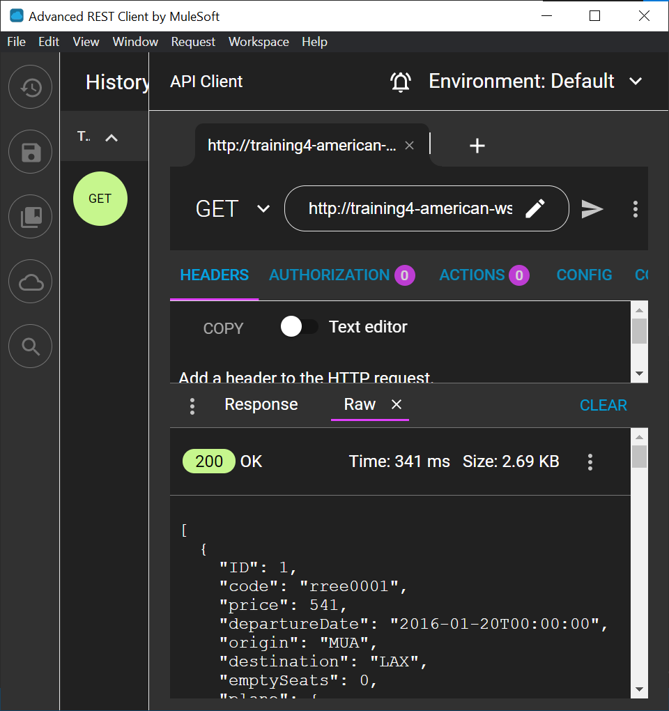

# MuleSoft - Connecting data to applications 

<a src="https://blogs.mulesoft.com/learn-apis/api-led-connectivity/what-is-api-led-connectivity/">API - Led connectivity</a> is a methodical way to connect data to applications through reusable and purposeful <a src="https://developer.mozilla.org/es/docs/Learn/JavaScript/Client-side_web_APIs/Introduction"> API </a> (available prebuild connection points for several programming languages) that allows developers create complex functionalities for an easy consumption when developing an application, not worring about what's going on under the hood, just the necessary means of connections like an electrical outlet on a wall.
<figure>
     
    <figcaption>Electrical outlet; source: MDN Web Docs. </figcaption>
</figure>

This notes embrace:
* What an application network is and its benefits.
* How to build an application network using API-led connectivity.
* An Explanation of what web services and APIs are.
* Making calls to secure and unsecured APIs.

----

**The usefulness of this for businesses**

The constant rate of change on IT require to levarage new ways to create assets to be consumed by business fast enough.

### Purpose of reausable assets
It is import for organizations the cycle of **production** as well as **consumption** of data for IT, either for own development of services or better fit the needs of consumers.

The main idea is that **data sources** are now needed to be accesible, flexible to grow, secure enough to continue  developing different applications regardless the numerous development of projects or the amount of time passed.

## API-Led connectivity mindset is:

* **Assets** have to be <a src="https://en.wikipedia.org/wiki/Composability" alt="Composability"> composable </a>; a highly composable system provides components that can be selected and assembled in various combinations to satisfy specific user requirements, in order to make reusable data.

<figure>
    
    <figcaption>API-Led connectivity example</figcaption>
</figure>

## Center for enablement (C4E)
Ensures that assets are:
* Productized and published.
* Consumable.
* Consumable abroadly.
* Fully leveraged.

Is a cross functional team ensuring all new projects uses current assets and producing new ones when needed.  

## Achieveing an Application network
Within an organizations there are many different systems been used, legacy databases, social apps and many more, that are side loaded.

<figure>
    
    <figcaption>node of network</figcaption>
</figure>

## What is an API?
Stands for Application Programming Interface, they have existed since the advent of programming languages, from 50s to 60s and provide us the info for *how ro communicate with a software component*  but it could be referring to a number of things:
* API interface definition file (API specification).
    * Defines what you can call, what you send it, and what you get back.
* A web service.
    * Te actual API documentation you can make calls or to the interface of that API implementation.
* An API proxy
    * An application that controls access to a web service, restricting access and usage through the use of an API gateway.

## What is a web service?
Is a method of communication that allows two software systems to exchange data over the internet, with some rules required.
* **A web service API**: comprehensive description of how a client interacts with the web service.
* **The web serice interface implementing the API**: Is the code providing the structure to the application so it implements the API.
* **The web service implementation itself**: is the actual code and application.

### There are 2 main types of web services
* SOAP web services:
    * traditional, more complez type,
    * The communication rules are defined in an XML-based WSDL (Web services Description Languafe) file

* RESTful web services
    * Recent, simpler type.
    * Use the existing HTTP communication protocol.

### RESTful web services
Stands for Representational State Transfer.
It defines how systems comunicate using HTTTP protocol.

**HTTP** request method indicates which operation should be performed on the object identifies by the URL.
Examples of RESTful calls:
* (GET)/companies
* (GET)/companies?country=France
* (GET)/companies/3
* (POST)/companies with JSON/XML in HTTP body
* (DELETE)/companies/3
* (PUT)/companies/3 with JSON/XML in HTTP body

**GET** retrieves the current state of a resource in some representation (usually JSON or XML)

**POST** creates a new resource

**PUT** replaces a resource completely, if the resource doesn't exist, a new one is created

**PATCH** partially updates a resource, just submitted data

---

## Calling RESTful web services
Sources:
* American Flights web service
http://training4-american-ws.cloudhub.io/api/flights
* REST API Vimeo http://www.programmableweb.com/api/vimeo-rest-api 

Making a call to a RESTful API is posible using a client tool, such as <a src="https://www.postman.com/" alt="postaman oficial page">Postman </a>, <a src="https://www.postman.com/">Advnaced REST Client</a>, or <a src="https://curl.se/docs/manpage.html">cURL</a> a command line utility.

You can make calls to secure and unsecure APIs, here's the catch:
* **Unsecured APIs**, the API may be public and require no authentication.
* **Secured APIs**, the APImay be secured and require authentication
    * You may need to provide credentials and/or a token
    * Often a proxy is created to govern access to an API
    * We will call and then later create an API secured by credentials
    * You can also secure an API with other authentication protocols, such as OAuth, SAML, JWT and more.

This training will make calls to and create a secured API.

### Getting response from web service calls
* RESTful web services return HTTP status code with the response
* <a src="https://developer.mozilla.org/es/docs/Web/HTTP/Status" alt="HTTP status codes">The status code</a> provides client feedback for the outcome of the operation (succeded, failed, upadates), there are 55 HTTP codes.

* Using Advanced REST Client, will be making several calls to an unsecured API (an implementation), no need of token or authentication.
* Make GET, DELETE, POST and PUT calls
* Use ARC to make calls to a secured API (an API proxy), authentication is needed
* Using API console in an API portal to make calls to a managed API using a mocking service.
* Using the API console to make calls to an API proxy endpoint.

## Using Advanced REST Client to make GET requests to retrieve data
1. Open Advanced REST Client
2. Make sure the method is set to GET
3. Return to the course ``snippets.txt`` file.
4. Copy the URL for the American Flights web service: http://training4-american-ws.cloudhub.io/api/flights 
5. Return to Advanced REST client and paste the URL in the box that says Request URL, replacing any existing content.

6. Click the send button, you should get a response.
7. Locate the return HTTP status code of 200.
8. Review the response body containing flights to SFO, LAX, and CLE.
 
9. Select Raw from the options menu in the response area

10. Click the Open parameters editor icon (the pencil) to the right of the URL
11. In the query parameters editor area that appears, click the Add button.
12. Set the parameters name to the destination and the parameter value to CLE then click Close.

13. Click the Send request button, you should get just the flights to CLE returned.
14. Edit the query parameters again, click te Remove this parameter button next to the parameter to delete it then click Close.
15. Change the request URL to add a URI parameter to retrieve the flight with an ID of 3: http://training4-american-ws.cloudhub.io/api/flights/3 
16. Click the send button, you should see only the lfight with an ID returned.

**Make DELETE requests to delete data**
17. Change the method to DELETE.
18. Click the Send button, you should see a 200 response with the message Flight deleted
<figure>
    
    <figcaption>DELETE HTTP method</figcaption>
</figure>